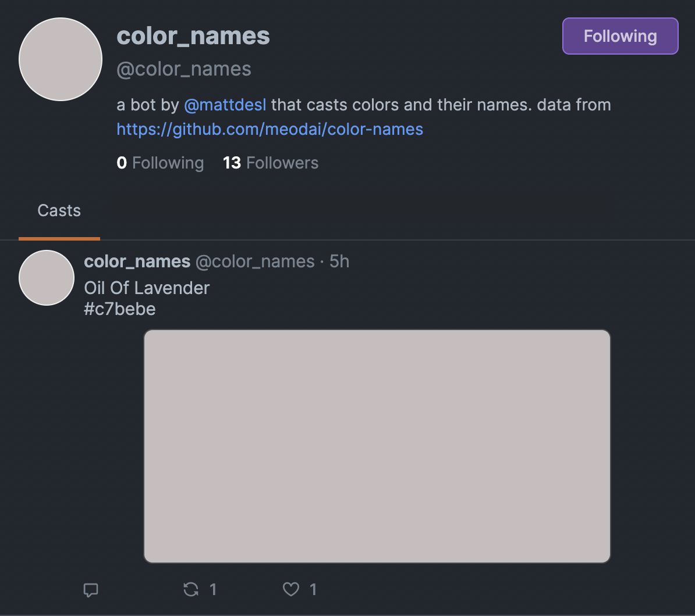

# fc-bot-color-names

A Farcaster bot that sends random color names to the network, using data from [meodai/color-names](https://github.com/meodai/color-names). The bot is currently registered to the alias `@color_names` and the following public address:

`0x8AD04DD9415275B92b672CCBC09F40fAc55aAD48`

How it looks:



#### Note:

As Farcaster is in beta, this is likely going to break in their next major update, but it can act as a simple example of how to build a bot for this network.

## Running Locally

```sh
npm install

# publish once per 24 hours
PRIVATE_KEY=[your_bot_key] node ping
```

## Creating Your Own Bot

First register a new account on [Farcaster](https://farcaster.xyz/) (note: registration is currently in closed beta). Copy (and save in a secure way) your newly generated seed phrase, and with it still in your clipboard, you can use the following command:

```sh
pbpaste | node key.js
```

This will provide the private key that you can save in a `.env` config file that allows you to run the bot without manually specifying the key each time:

```sh
node ping
```

## Files

- `ping.js` runs once every 24 hours
- `publish.js` core of the bot
- `key.js` prints the private key of the seed phrase coming from stdin
- `server.js` runs a server that has a secret entry point that will trigger the bot

## License

MIT, see [LICENSE.md](http://github.com/mattdesl/fc-bot-color-names/blob/master/LICENSE.md) for details.
